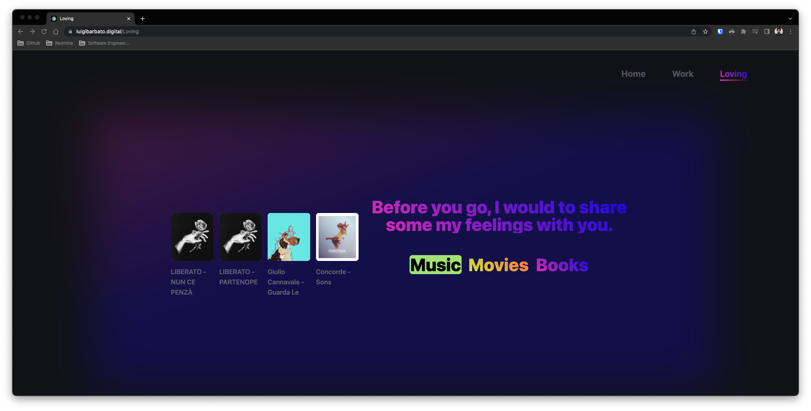

# [luigibarbato.digital](https://luigibarbato.digital/)

[](https://luigibarbato.digital/)
[](https://luigibarbato.digital/)

## 📦 Made with

- Next.js
- Typescript
- styled-components
- SWR
- Vercel
## 💻 Getting Started

Install dependencies:

```bash
pnpm install
```

Then, run the development server:

```bash
pnpm run dev
```

Open [http://localhost:3000](http://localhost:3000) with your browser to see the result.

## 🗝 License

This project is licensed under the GPLv3 License - see the [LICENSE](LICENSE) file for details.